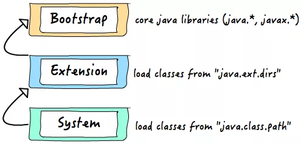
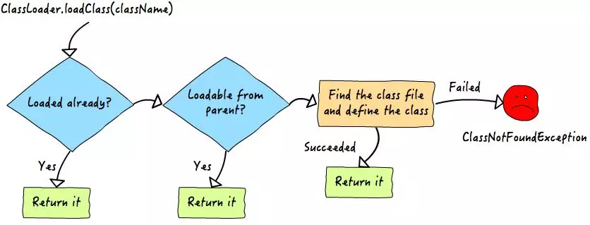

> `Java`中的所有类，必须被装载到`jvm`中才能运行，这个装载工作是由`jvm`中的类装载器完成的，类装载器所做的工作实质是把类文件从硬盘读取到内存中，`JVM`在加载类的时候，都是通过`ClassLoader`的`loadClass（）`方法来加载class的，`loadClass`使用**双亲委派模式**。
>
> 为了更好的理解类的加载机制，我们来深入研究一下`ClassLoader`和他的`loadClass（）`方法。

首先看一下 `public abstract class ClassLoader` 类，他是一个抽象类，源码中解释为：

```java
/**
 * A class loader is an object that is responsible for loading classes. The
 * class <tt>ClassLoader</tt> is an abstract class.  Given the <a
 * href="#name">binary name</a> of a class, a class loader should attempt to
 * locate or generate data that constitutes a definition for the class.  A
 * typical strategy is to transform the name into a file name and then read a
 * "class file" of that name from a file system.
 */
```

大致意思是：

```java
类加载器（class loader）是一个负责加载JAVA类（classes）的对象，ClassLoader类是一个抽象类，需要给出类的二进制名称，class loader尝试定位或者产生一个class的数据，一个典型的策略是把二进制名字转换成文件名然后到文件系统中找到该文件。
```

接下来看 loadClass 方法的实现方式：

```java
protected Class<?> loadClass(String name, boolean resolve)
        throws ClassNotFoundException
{
    synchronized (getClassLoadingLock(name)) {
        // First, check if the class has already been loaded
        Class<?> c = findLoadedClass(name);
        if (c == null) {
            long t0 = System.nanoTime();
            try {
                if (parent != null) {
                    c = parent.loadClass(name, false);
                } else {
                    c = findBootstrapClassOrNull(name);
                }
            } catch (ClassNotFoundException e) {
                // ClassNotFoundException thrown if class not found
                // from the non-null parent class loader
            }

            if (c == null) {
                // If still not found, then invoke findClass in order
                // to find the class.
                long t1 = System.nanoTime();
                c = findClass(name);

                // this is the defining class loader; record the stats
                sun.misc.PerfCounter.getParentDelegationTime().addTime(t1 - t0);
                sun.misc.PerfCounter.getFindClassTime().addElapsedTimeFrom(t1);
                sun.misc.PerfCounter.getFindClasses().increment();
            }
        }
        if (resolve) {
            resolveClass(c);
        }
        return c;
    }
}
```

该方法源码解释内容大致为：

- 使用指定的二进制名称来加载类，这个方法的默认实现按照以下顺序查找类： 
  - 调用findLoadedClass(String)方法检查这个类是否被加载过 
  - 使用父加载器调用loadClass(String)方法，如果父加载器为Null，类加载器装载虚拟机内置的加载器
  - 调用findClass(String)方法装载类

-  如果，按照以上的步骤成功的找到对应的类，并且该方法接收的`resolve`参数的值为`true`,那么就调用`resolveClass(Class) `方法来处理类。 `ClassLoader`的子类最好覆盖`findClass(String)`而不是这个方法(loadClass)。 **除非被重写，这个方法默认在整个装载过程中都是** **`同步`的（`线程安全`的）** 

分析该方法：

该方法的访问控制符是 `protected` ，也就是说该方法 同一包内和派生类中可用。返回值类型 `Class<?>` ，这里用到泛型。 这里使用通配符`?`作为泛型实参表示对象可以接受任何类型(类类型)。因为该方法不知道要加载的类到底是什么类，所以就用了通用的泛型。`String name`要查找的类的名字，`boolean resolve`，一个标志，`true`表示将调用`resolveClass(c)`处理该类

 **throws ClassNotFoundException** 该方法会抛出找不到该类的异常，这是一个非运行时异常 

 **synchronized (getClassLoadingLock(name))** 看到这行代码，我们能知道的是，这是一个同步代码块，那么`synchronized`的括号中放的应该是一个对象。我们来看`getClassLoadingLock(name)`方法的作用是什么： 

```java
protected Object getClassLoadingLock(String className) {
    Object lock = this;
    if (parallelLockMap != null) {
        Object newLock = new Object();
        lock = parallelLockMap.putIfAbsent(className, newLock);
        if (lock == null) {
            lock = newLock;
        }
    }
    return lock;
}
```

 以上是`getClassLoadingLock(name)`方法的实现细节，我们看到这里用到变量`parallelLockMap`，根据这个变量的值进行不同的操作，如果这个变量是Null，那么直接返回`this`，如果这个属性不为Null，那么就新建一个对象，然后在调用一个`putIfAbsent(className, newLock);`方法来给刚刚创建好的对象赋值，这个方法的作用我们一会讲。那么这个`parallelLockMap`变量又是哪来的那，我们发现这个变量是`ClassLoader`类的成员变量： 

```java
private final ConcurrentHashMap<String, Object> parallelLockMap;
```

 这个变量的初始化工作在`ClassLoader`的构造函数中： 

```java
private ClassLoader(Void unused, ClassLoader parent) {
    this.parent = parent;
    if (ParallelLoaders.isRegistered(this.getClass())) {
        parallelLockMap = new ConcurrentHashMap<>();
        package2certs = new ConcurrentHashMap<>();
        domains =
            Collections.synchronizedSet(new HashSet<ProtectionDomain>());
        assertionLock = new Object();
    } else {
        // no finer-grained lock; lock on the classloader instance
        parallelLockMap = null;
        package2certs = new Hashtable<>();
        domains = new HashSet<>();
        assertionLock = this;
    }
}
```

 这里我们可以看到构造函数根据一个属性`ParallelLoaders`的`Registered`状态的不同来给`parallelLockMap` 赋值。 我去，隐藏的好深，好，我们继续挖，看看这个`ParallelLoaders`又是在哪赋值的呢？我们发现，在ClassLoader类中包含一个静态内部类`private static class ParallelLoaders`，在`ClassLoader`被加载的时候这个静态内部类就被初始化。这个静态内部类的代码我就不贴了，直接告诉大家什么意思，sun公司是这么说的：`Encapsulates the set of parallel capable loader types`，意识就是说：封装了并行的可装载的类型的集合。 

> 上面这个说的是不是有点乱，那让我们来整理一下： 
>
> 首先，在ClassLoader类中有一个静态内部类`ParallelLoaders`，他会指定的类的并行能力，如果当前的加载器被定位为具有并行能力，那么他就给`parallelLockMap`定义，就是`new`一个 `ConcurrentHashMap<>()`，那么这个时候，我们知道如果当前的加载器是具有并行能力的，那么`parallelLockMap`就不是`Null`，这个时候，我们判断`parallelLockMap`是不是`Null`，如果他是null，说明该加载器没有注册并行能力，那么我们没有必要给他一个加锁的对象，`getClassLoadingLock`方法直接返回`this`，就是当前的加载器的一个实例。
>
> 如果这个`parallelLockMap`不是`null`，那就说明该加载器是有并行能力的，那么就可能有并行情况，那就需要返回一个锁对象。然后就是创建一个新的Object对象，调用`parallelLockMap`的`putIfAbsent(className, newLock)`方法，这个方法的作用是：首先根据传进来的className,检查该名字是否已经关联了一个value值，如果已经关联过value值，那么直接把他关联的值返回，如果没有关联过值的话，那就把我们传进来的Object对象作为value值，className作为Key值组成一个map返回。然后无论putIfAbsent方法的返回值是什么，都把它赋值给我们刚刚生成的那个Object对象。 
>
> 这个时候，我们来简单说明下`getClassLoadingLock(String className)`的作用，就是： 为类的加载操作返回一个锁对象。为了向后兼容，这个方法这样实现:如果当前的classloader对象注册了并行能力，方法返回一个与指定的名字className相关联的特定对象，否则，直接返回当前的ClassLoader对象。

 接着，我们的代码分析到**Class c = findLoadedClass(name);** 在这里，在加载类之前先调用该方法检查该类是否已经被加载过，`findLoadedClass`会返回一个`Class`类型的对象，如果该类已经被加载过，那么就可以直接返回该对象（在返回之前会根据`resolve`的值来决定是否处理该对象，具体的怎么处理后面会讲）。 如果，该类没有被加载过，那么执行以下的加载过程。 

```java
try {
    if (parent != null) {
        c = parent.loadClass(name, false);
    } else {
        c = findBootstrapClassOrNull(name);
    }
} catch (ClassNotFoundException e) {
    // ClassNotFoundException thrown if class not found
    // from the non-null parent class loader
}
```

如果父加载器不为空，那么调用父加载器的`loadClass`方法加载类，如果父加载器为空，那么调用虚拟机的加载器来加载类。

如果以上两个步骤都没有成功的加载到类。那么执行以下过程：

```java
if (c == null) {
    // If still not found, then invoke findClass in order
    // to find the class.
    long t1 = System.nanoTime();
    c = findClass(name);

    // this is the defining class loader; record the stats
    sun.misc.PerfCounter.getParentDelegationTime().addTime(t1 - t0);
    sun.misc.PerfCounter.getFindClassTime().addElapsedTimeFrom(t1);
    sun.misc.PerfCounter.getFindClasses().increment();
}
```

c = findClass(name)表示当前classloader自己来加载类。

这个时候，我们已经得到了加载之后的类，那么就根据`resolve`的值决定是否调用`resolveClass`方法。`resolveClass`方法的作用是：

> **链接指定的类。**这个方法给`Classloader`用来链接一个类，如果这个类已经被链接过了，那么这个方法只做一个简单的返回。否则，这个类将被按照 `Java™`规范中的`Execution`描述进行链接。。。

至此，ClassLoader类以及loadClass方法的源码我们已经分析完了，那么。结合源码的分析，我们来总结一下。

## 总结

**在总结之前，我们先来简单介绍下类加载相关的知识，Java中的类大致分为三种：**

> 1.系统类 、2.扩展类 、3.由程序员自定义的类

**类装载方式，有两种:**

> 1.隐式装载， 程序在运行过程中当碰到通过new 等方式生成对象时，隐式调用类装载器加载对应的类到jvm中。 
>
> 2.显式装载， 通过class.forname()等方法，显式加载需要的类

**类加载的动态性体现:**

> 一个应用程序总是由n多个类组成，Java程序启动时，并不是一次把所有的类全部加载后再运行，它总是先把保证程序运行的基础类一次性加载到jvm中，其它类等到jvm用到的时候再加载，这样的好处是节省了内存的开销，因为java最早就是为嵌入式系统而设计的，内存宝贵，这是一种可以理解的机制，而用到时再加载这也是java动态性的一种体现

**java类装载器**

Java中的类装载器实质上也是类，功能是把类载入jvm中，值得注意的是jvm的类装载器并不是一个，而是三个，层次结构如下：



为什么要有三个类加载器，一方面是分工，各自负责各自的区块，另一方面为了实现委托模型，下面会谈到该模型。

**类加载器之间是如何协调工作的**

前面说了，java中有三个类加载器，问题就来了，碰到一个类需要加载时，它们之间是如何协调工作的，即java是如何区分一个类该由哪个类加载器来完成呢。如前面我们分析的代码一样，Java采用了**委托模型机制**来加载类，这个机制简单来讲，就是“**类装载器有载入类的需求时，会先请示其Parent使用其搜索路径帮忙载入，如果Parent 找不到,那么才由自己依照自己的搜索路径搜索类，如果搜索不到，则抛出ClassNotFoundException**”



类装载工作由`ClassLoder`和其子类负责。JVM在运行时会产生三个ClassLoader：**根装载器**，`ExtClassLoader`(**扩展类装载器**)和`AppClassLoader`，其中根装载器不是ClassLoader的子类，由C++编写，因此在java中看不到他，负责装载JRE的核心类库，如java.*,。`ExtClassLoader`是`ClassLoder`的子类，负责装载JRE扩展目录ext下的jar类包；**`AppClassLoader`负责装载classpath路径下的类包，这三个类装载器存在父子层级关系****，即根装载器是ExtClassLoader的父装载器，ExtClassLoader是AppClassLoader的父装载器。默认情况下使用AppClassLoader装载应用程序的类**

下面举一个例子来说明，为了更好的理解，先弄清楚几行代码：

```java
public class Test{
    public static void main(String[] args) {
        ClassLoader c = Test.class.getClassLoader();	// 获取test类的类加载器
        System.out.println(c);
        ClassLoader c1 = c.getParent();	// 获取c这个类加载器的父类加载器
        System.out.println(c1);
        ClassLoader c2 = c1.getParent();	// 获取c1这个类加载器的父类加载器
        System.out.println(c2);
    }
}
```

运行结果：

```java
...AppClassLoader...
...ExtClassLoader...
Null
```

可以看出Test是由**AppClassLoader**加载器加载的，**AppClassLoader**的`Parent` 加载器是 **ExtClassLoader**,但是`ExtClassLoader`的`Parent`为 `null` 是怎么回事呵，朋友们留意的话，前面有提到**Bootstrap Loader**是用C++语言写的，依java的观点来看，逻辑上并不存在**Bootstrap Loader**的类实体，所以在`java`程序代码里试图打印出其内容时，我们就会看到输出为`null`。

Java装载类使用“**全盘负责委托机制**”。“**全盘负责**”是指当一个`ClassLoder`装载一个类时，除非显示的使用另外一个`ClassLoder`，该类所依赖及引用的类也由这个`ClassLoder`载入；“**委托机制**”是指先委托父类装载器寻找目标类，只有在找不到的情况下才从自己的类路径中查找并装载目标类。

这一点是从安全方面考虑的，试想如果一个人写了一个恶意的基础类（如`java.lang.String`）并加载到`JVM`将会引起严重的后果，但有了全盘负责制，`java.lang.String`永远是由根装载器来装载，避免以上情况发生 除了JVM默认的三个`ClassLoder`以外，第三方可以编写自己的类装载器，以实现一些特殊的需求。

类文件被装载解析后，在`JVM`中都有一个对应的`java.lang.Class`对象，提供了类结构信息的描述。数组，枚举及基本数据类型，甚至`void`都拥有对应的`Class`对象。`Class`类没有`public`的构造方法，`Class`对象是在装载类时由`JVM`通过调用类装载器中的`defineClass()`方法自动构造的。