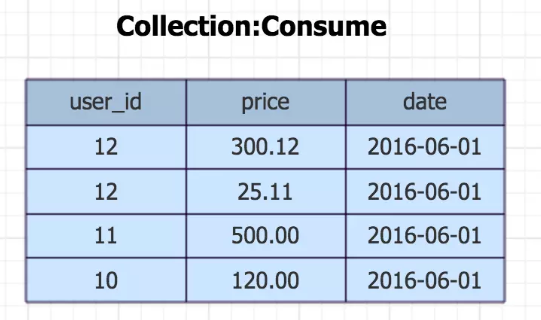
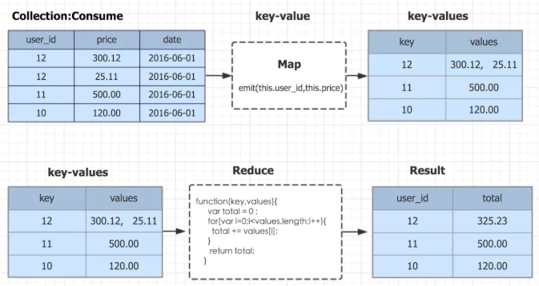

命令方式：

```java
db.collection.mapReduce(
    map,    //map函数（生成键值对序列,作为 reduce 函数参数）
    reduce, //reduce函数
    {
        <out>,    //存放输出结果的集合，不写使用临时集合
        <query>, //筛选条件，符合条件才会进入map
        <sort>,   //排序
        <limit>,  //限制条数
        <finalize>, 
        <scope>, 
        <jsMode>, 
        <verbose>
    }
)
```

举例：



计算每个用户 2016-06-01 这天的消费金额

```java
db.consume.mapReduce(
    function(){ emit( this.user_id,this.price ) },
    function(key,values){ 
      var total = 0 ;
      for(var i=0;i<values.length;i++){
        total += values[i];
      }
       return total;
    },//end reduce function
    {
        query:{"date":"2016-06-01"}
    }
)
```

> 上文中的例子主要逻辑是，将集合中的文档按user_id分组，得到以user_id为key的数组，形成key－values的映射关系，再将key－values的映射关系做为参数，放入reduce函数，reduce函数，迭代values数组，将values数据内的消费金额叠加，返回total总值；



- 将consume集合内的数据按照每天每个客户汇总金额

```jsx
var mapfunction = function(){
    emit( {this.date, this.user_id}，this.price} )
}

var reducefunction = function(key,values){ 
      var total = 0 ;
      for(var i=0;i<values.length;i++){
        total += values[i];
      }
      return total;
 }

db.consume.mapReduce(
    mapfunction,
    reducefunction
)
```

其他的示例：

```java
 book = new BasicDBObject();  
   book.put("name", "Understanding Axis2");  
   book.put("pages", 150);  
   books.insert(book);  
     
   String map = "function() { "+   
             "var category; " +    
             "if ( this.pages >= 250 ) "+    
             "category = 'Big Books'; " +  
             "else " +  
             "category = 'Small Books'; "+    
             "emit(category, {name: this.name});}";  
     
   String reduce = "function(key, values) { " +  
                            "var sum = 0; " +  
                            "values.forEach(function(doc) { " +  
                            "sum += 1; "+  
                            "}); " +  
                            "return {books: sum};} "; 
结果显示：
{ "_id" : "Big Books", "value" : { "books" : 2 } } 
{ "_id" : "Small Books", "value" : { "books" : 3 } } 
```

