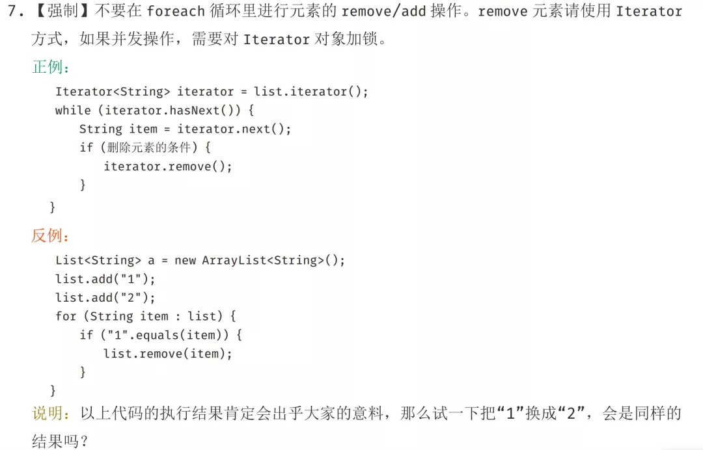
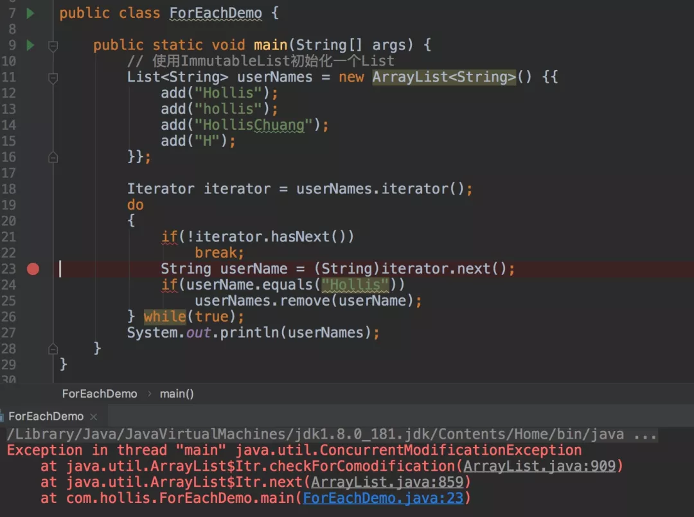

在阿里巴巴 Java 开发手册中，有这样一条规定：



但是手册中并没有给出具体的原因，下面来分析以下该规定背后的思考：

## foreach 循环

foreach 循环（foreach loop）是计算机编程语言中的一种控制流程语句，通常用来循环遍历数组或集合中的元素。

Java语言从JDK 1.5.0开始引入foreach循环。在遍历数组、集合方面，foreach为开发人员提供了极大的方便。通常也被称之为增强for循环。

foreach 语法格式如下：

```java
for(元素类型t 元素变量x : 遍历对象obj){ 
     引用了x的java语句; 
} 
```

以下实例演示了 普通for循环 和 foreach循环使用：

```java
public static void main(String[] args) {
    // 使用ImmutableList初始化一个List
    List<String> userNames = ImmutableList.of("Hollis", "hollis", "HollisChuang", "H");

    System.out.println("使用for循环遍历List");
    for (int i = 0; i < userNames.size(); i++) {
        System.out.println(userNames.get(i));
    }

    System.out.println("使用foreach遍历List");
    for (String userName : userNames) {
        System.out.println(userName);
    }
}
```

其实，增强for循环也是Java给我们提供的一个语法糖，如果将以上代码编译后的class文件进行反编译（使用jad工具）的话，可以得到以下代码：

```java
Iterator iterator = userNames.iterator();
do
{
    if(!iterator.hasNext())
        break;
    String userName = (String)iterator.next();
    if(userName.equals("Hollis"))
        userNames.remove(userName);
} while(true);
System.out.println(userNames);
```

可以发现，原本的增强for循环，其实是依赖了while循环和Iterator实现的。（请记住这种实现方式，后面会用到！）

## 问题重现

规范中指出不让我们在 foreach 循环中对集合元素做 add/remove 操作，那么，我们尝试着做一下看看会发生什么问题。

```java
// 使用双括弧语法（double-brace syntax）建立并初始化一个List
List<String> userNames = new ArrayList<String>() {{
    add("Hollis");
    add("hollis");
    add("HollisChuang");
    add("H");
}};

for (int i = 0; i < userNames.size(); i++) {
    if (userNames.get(i).equals("Hollis")) {
        userNames.remove(i);
    }
}

System.out.println(userNames);
```

以上代码，首先使用双括弧语法（double-brace syntax）建立并初始化一个List，其中包含四个字符串，分别是Hollis、hollis、HollisChuang和H。

然后使用普通for循环对List进行遍历，删除List中元素内容等于Hollis的元素。然后输出List，输出结果如下：

```text
[hollis, HollisChuang, H]
```

以上是使用普通的for循环在遍历的同时进行删除，那么，我们再看下，如果使用增强for循环的话会发生什么：

```java
List<String> userNames = new ArrayList<String>() {{
    add("Hollis");
    add("hollis");
    add("HollisChuang");
    add("H");
}};

for (String userName : userNames) {
    if (userName.equals("Hollis")) {
        userNames.remove(userName);
    }
}

System.out.println(userNames);
```

以上代码，使用增强for循环遍历元素，并尝试删除其中的Hollis字符串元素。运行以上代码，会抛出以下异常：

```text
java.util.ConcurrentModificationException
```

同样的，在增强for循环中使用add方法添加元素，结果也会同样抛出该异常。

之所以会出现这个异常，是因为触发了一个Java集合的错误检测机制——fail-fast 。

## fail-fast

接下来，我们就来分析下在增强for循环中add/remove元素的时候会抛出java.util.ConcurrentModificationException的原因，即解释下到底什么是fail-fast进制，fail-fast的原理等。

fail-fast，即快速失败，它是Java集合的一种错误检测机制。当多个线程对集合（非fail-safe的集合类）进行结构上的改变的操作时，有可能会产生fail-fast机制，这个时候就会抛出ConcurrentModificationException（当方法检测到对象的并发修改，但不允许这种修改时就抛出该异常）。

同时需要注意的是，即使不是多线程环境，如果单线程违反了规则，同样也有可能会抛出改异常。

那么，在增强for循环进行元素删除，是如何违反了规则的呢？

要分析这个问题，我们先将增强for循环这个语法糖进行解糖（使用jad对编译后的class文件进行反编译），得到以下代码：

```java
public static void main(String[] args) {
    // 使用ImmutableList初始化一个List
    List<String> userNames = new ArrayList<String>() {{
        add("Hollis");
        add("hollis");
        add("HollisChuang");
        add("H");
    }};

    Iterator iterator = userNames.iterator();
    do
    {
        if(!iterator.hasNext())
            break;
        String userName = (String)iterator.next();
        if(userName.equals("Hollis"))
            userNames.remove(userName);
    } while(true);
    System.out.println(userNames);
}
```

然后运行以上代码，同样会抛出异常。我们来看一下ConcurrentModificationException的完整堆栈：



通过异常堆栈我们可以到，异常发生的调用链ForEachDemo的第23行，`Iterator.next` 调用了 `Iterator.checkForComodification`方法 ，而异常就是checkForComodification方法中抛出的。

其实，经过debug后，我们可以发现，如果remove代码没有被执行过，iterator.next这一行是一直没报错的。抛异常的时机也正是remove执行之后的那一次next方法的调用。

我们直接看下checkForComodification方法的代码，看下抛出异常的原因：

```java
final void checkForComodification() {
    if (modCount != expectedModCount)
        throw new ConcurrentModificationException();
}
```

代码比较简单，`modCount != expectedModCount`的时候，就会抛出`ConcurrentModificationException`。

那么，就来看一下，remove/add 操作室如何导致modCount和expectedModCount不相等的吧。

## remove/add 做了什么

首先，我们要搞清楚的是，到底modCount和expectedModCount这两个变量都是个什么东西。

通过翻源码，我们可以发现：

- modCount是ArrayList中的一个成员变量。它表示该集合实际被修改的次数。
- expectedModCount 是 ArrayList中的一个内部类——Itr中的成员变量。expectedModCount表示这个迭代器期望该集合被修改的次数。其值是在ArrayList.iterator方法被调用的时候初始化的。只有通过迭代器对集合进行操作，该值才会改变。
- Itr是一个Iterator的实现，使用ArrayList.iterator方法可以获取到的迭代器就是Itr类的实例。

他们之间的关系如下：

```java
class ArrayList{
    private int modCount;
    public void add();
    public void remove();
    private class Itr implements Iterator<E> {
        int expectedModCount = modCount;
    }
    public Iterator<E> iterator() {
        return new Itr();
    }
}
```

其实，看到这里，大概很多人都能猜到为什么remove/add 操作之后，会导致expectedModCount和modCount不相等了。

通过翻阅代码，我们也可以发现，remove方法核心逻辑如下：

```java
private void fastRemove(int index) {
    modCount++;
    int numMoved = size - index - 1;
    if (numMoved > 0)
        System.arraycopy(elementData, index+1, elementData, index,
                         numMoved);
    elementData[--size] = null; // clear to let GC do its work
}
```

可以看到，它只修改了modCount，并没有对expectedModCount做任何操作。

简单总结一下，之所以会抛出ConcurrentModificationException异常，是因为我们的代码中使用了增强for循环，而在增强for循环中，集合遍历是通过iterator进行的，但是元素的add/remove却是直接使用的集合类自己的方法。这就导致iterator在遍历的时候，会发现有一个元素在自己不知不觉的情况下就被删除/添加了，就会抛出一个异常，用来提示用户，可能发生了并发修改。

## 正确做法

至此，我们介绍清楚了不能在 foreach 循环体中直接对集合进行add/remove操作的原因。

但是，很多时候，我们是有需求需要过滤集合的，比如删除其中一部分元素，那么应该如何做呢？有几种方法可供参考：

**1、直接使用普通for循环进行操作**

我们说不能在 foreach 中进行，但是使用普通的 for 循环还是可以的，因为普通 for 循环并没有用到 Iterator 的遍历，所以压根就没有进行 fail-fast 的检验。

```java
List<String> userNames = new ArrayList<String>() {{
    add("Hollis");
    add("hollis");
    add("HollisChuang");
    add("H");
}};

for (int i = 0; i < 1; i++) {
    if (userNames.get(i).equals("Hollis")) {
        userNames.remove(i);
    }
}
System.out.println(userNames);
```

**2、直接使用Iterator进行操作**

除了直接使用普通for循环以外，我们还可以直接使用Iterator提供的remove方法。

```java
List<String> userNames = new ArrayList<String>() {{
    add("Hollis");
    add("hollis");
    add("HollisChuang");
    add("H");
}};

Iterator iterator = userNames.iterator();

while (iterator.hasNext()) {
    if (iterator.next().equals("Hollis")) {
        iterator.remove();
    }
}
System.out.println(userNames);
```

如果直接使用Iterator提供的remove方法，那么就可以修改到expectedModCount的值。那么就不会再抛出异常了。其实现代码如下：

（私有内部类 Itr 实现了 Iterator 接口）

```java
public void remove() {
    if (lastRet < 0)
        throw new IllegalStateException();
    checkForComodification();

    try {
        AbstractList.this.remove(lastRet);
        if (lastRet < cursor)
            cursor--;
        lastRet = -1;
        expectedModCount = modCount;
    } catch (IndexOutOfBoundsException e) {
        throw new ConcurrentModificationException();
    }
}
```

**3、使用Java 8中提供的filter过滤**

Java 8中可以把集合转换成流，对于流有一种filter操作， 可以对原始 Stream 进行某项测试，通过测试的元素被留下来生成一个新 Stream。

```java
List<String> userNames = new ArrayList<String>() {{
    add("Hollis");
    add("hollis");
    add("HollisChuang");
    add("H");
}};

userNames = userNames.stream().filter(userName -> 		!userName.equals("Hollis")).collect(Collectors.toList());
System.out.println(userNames);
```

**4、直接使用fail-safe的集合类**

在Java中，除了一些普通的集合类以外，还有一些采用了fail-safe机制的集合类。这样的集合容器在遍历时不是直接在集合内容上访问的，而是先复制原有集合内容，在拷贝的集合上进行遍历。

由于迭代时是对原集合的拷贝进行遍历，所以在遍历过程中对原集合所作的修改并不能被迭代器检测到，所以不会触发ConcurrentModificationException。

```java
ConcurrentLinkedDeque<String> userNames = new ConcurrentLinkedDeque<String>() {{
    add("Hollis");
    add("hollis");
    add("HollisChuang");
    add("H");
}};

for (String userName : userNames) {
    if (userName.equals("Hollis")) {
        userNames.remove();
    }
}
```

基于拷贝内容的优点是避免了ConcurrentModificationException，但同样地，迭代器并不能访问到修改后的内容，即：迭代器遍历的是开始遍历那一刻拿到的集合拷贝，在遍历期间原集合发生的修改迭代器是不知道的。

java.util.concurrent包下的容器都是 fail-safe，可以在多线程下并发使用，并发修改。

**5、使用增强for循环其实也可以**

如果，我们非常确定在一个集合中，某个即将删除的元素只包含一个的话， 比如对Set进行操作，那么其实也是可以使用增强for循环的，只要在删除之后，立刻结束循环体，不要再继续进行遍历就可以了，也就是说不让代码执行到下一次的next方法。

```java
List<String> userNames = new ArrayList<String>() {{
    add("Hollis");
    add("hollis");
    add("HollisChuang");
    add("H");
}};

for (String userName : userNames) {
    if (userName.equals("Hollis")) {
        userNames.remove(userName);
        break;
    }
}
System.out.println(userNames);
```

以上这五种方式都可以避免触发fail-fast机制，避免抛出异常。如果是并发场景，建议使用concurrent包中的容器，如果是单线程场景，Java8之前的代码中，建议使用Iterator进行元素删除，Java8及更新的版本中，可以考虑使用Stream及filter。

## 总结

我们使用的增强for循环，其实是Java提供的语法糖，其实现原理是借助Iterator进行元素的遍历。

但是如果在遍历过程中，不通过Iterator，而是通过集合类自身的方法对集合进行添加/删除操作。那么在Iterator进行下一次的遍历时，经检测发现有一次集合的修改操作并未通过自身进行，那么可能是发生了并发被其他线程执行的，这时候就会抛出异常，来提示用户可能发生了并发修改，这就是所谓的fail-fast机制。

当然还是有很多种方法可以解决这类问题的。比如使用普通for循环、使用Iterator进行元素删除、使用Stream的filter、使用fail-safe的类等。