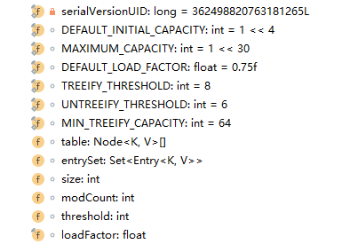

## HashMap 中重要的成员变量



上面是 Java 8 中 HashMap 中的主要成员变量图，其中有几个是要关注的：size、loadfactor、threshold、DEFAULT_LOAD_DACTOR 和 DEFAULT_INITIAL_CAPACITY。

- transient int size;
  - 记录了 Map 中 KV 对的个数

- loadFactor
  - 装载因子，用来衡量 HashMap 满的程度。loadFactor 的默认值为 0.75（static final float DEFAULT_LOAD_FACTOR = 0.75f）。

- int threshold
  - 临界值，当实际的 kv 个数超过 threshold 时，HashMap 会将容量扩容，threshold = 容量 * 加载因子。
- 除了以上这些重要成员变量外，HashMap 中还有一个和他们紧密相关的概念：capacity
  - 容量，如果不指定，默认容量是16（static final int DEFAULT_INITIAL_CAPACITY = 1 << 4; // aka 16）。

## size 和 capacity

HashMap 中的 size 和 capacity 之间的区别其实解释起来挺简单的。HashMap 就像一个“桶”，那么 capacity 就是这个桶“当前”最多可以装多少元素，而 size 表示这个桶已经装了多少元素。来看下代码：

```java
@Test
public void map() throws Exception {
    Map<String, String> map = new HashMap<>();
    map.put("hello", "world");

    Class<? extends Map> mapType = map.getClass();
    Method capacity = mapType.getDeclaredMethod("capacity");
    capacity.setAccessible(true);
    System.out.println("capacity:" + capacity.invoke(map));

    Field size = mapType.getDeclaredField("size");
    size.setAccessible(true);
    System.out.println("size:" + size.get(map));
}
```

定义了一个新的 HashMap，并向其中 put 了一个元素，然后通过反射的方式打印 capacity 和 size。输出结果为：capacity:16   size:1

默认情况下，一个 HashMap 的容量（capacity）是16，设计成16的好处，参考 [Map 中的 hash()](interview/Map-中的-hash().md)，主要是可以使用按位与替代取模来提升 hash 的效率。

为什么说 capacity 就是这个桶“当前”最多可以装多少元素呢？当前怎么理解呢。其实，HashMap 是具有扩容机制的。在一个 HashMap 第一次初始化的时候，默认情况下它的容量是16，当达到扩容条件的时候，就需要进行扩容了，会从16扩容为32。

我们知道，HashMap 的重载的构造函数中，有一个是支持传入 initCapacity 的，那么我们尝试着设置一下，看结果如何。

```java
Map<String, String> map = new HashMap<>(1);
map.put("hello", "world");
Class<? extends Map> mapType = map.getClass();
Method capacity = mapType.getDeclaredMethod("capacity");
capacity.setAccessible(true);
System.out.println("capacity:" + capacity.invoke(map));

Map<String, String> map = new HashMap<>(7);
map.put("hello", "world");
Class<? extends Map> mapType = map.getClass();
Method capacity = mapType.getDeclaredMethod("capacity");
capacity.setAccessible(true);
System.out.println("capacity:" + capacity.invoke(map));

Map<String, String> map = new HashMap<>(9);
map.put("hello", "world");
Class<? extends Map> mapType = map.getClass();
Method capacity = mapType.getDeclaredMethod("capacity");
capacity.setAccessible(true);
System.out.println("capacity:" + capacity.invoke(map));
```

分别执行以上3段代码，分别输出：capacity：2、capacity：8、capacity：16

也就是说，默认情况下 HashMap 的容量是16，但是，如果用户通过构造函数指定了一个数字作为容量，那么 Hash 会选择大于该数字的第一个2的幂作为容量。（1->2、7->8、9->16）

> 建议：在初始化 HashMap 的时候，应该尽量指定其大小。尤其是当你已知map中存放的元素个数时。（《阿里巴巴Java开发公约》）

## loadFactor 和 threshold

上面提到，HashMap 有扩容机制，就是当达到扩容条件时会进行扩容，从16扩容到32、64、128...

那么，这个扩容条件指的是什么呢？

其实、HashMap 的扩容条件就是当 HashMap 中的元素个数（size）超过临界值（threshold）时就会自动扩容。

在 HashMap 中，threshold = loadFactor * capacity。

loadFactor 是装载因子，表示 HashMap 满的程度，默认值为 0.75f，设置成 0.75 有一个好处，那就是 0.75 正好是 3/4，而 capacity 又是 2 的幂。所以，两个数的乘积都是整数（capacity为2也同样）。

对于一个默认的 HashMap 来说，默认情况下，当其 size 大于 12（16*0.75）时就会触发扩容。

验证代码如下：

```java
Map<String, String> map = new HashMap<>(9);
map.put("hello1", "world");
map.put("hello2", "world");
map.put("hello3", "world");
map.put("hello4", "world");
map.put("hello5", "world");
map.put("hello6", "world");
map.put("hello7", "world");
map.put("hello8", "world");
map.put("hello9", "world");
map.put("hello10", "world");
map.put("hello11", "world");
map.put("hello12", "world");
Class<? extends Map> mapType = map.getClass();

Method capacity = mapType.getDeclaredMethod("capacity");
capacity.setAccessible(true);
System.out.println("capacity:" + capacity.invoke(map));

Field size = mapType.getDeclaredField("size");
size.setAccessible(true);
System.out.println("size:" + size.get(map));

Field threshold = mapType.getDeclaredField("threshold");
threshold.setAccessible(true);
System.out.println("threshold : " + threshold.get(map));

Field loadFactor = mapType.getDeclaredField("loadFactor");
loadFactor.setAccessible(true);
System.out.println("loadFactor : " + loadFactor.get(map));

map.put("hello13", "world");
Method capacity = mapType.getDeclaredMethod("capacity");
capacity.setAccessible(true);
System.out.println("capacity:" + capacity.invoke(map));

Field size = mapType.getDeclaredField("size");
size.setAccessible(true);
System.out.println("size:" + size.get(map));

Field threshold = mapType.getDeclaredField("threshold");
threshold.setAccessible(true);
System.out.println("threshold : " + threshold.get(map));

Field loadFactor = mapType.getDeclaredField("loadFactor");
loadFactor.setAccessible(true);
System.out.println("loadFactor : " + loadFactor.get(map));
```

输出结果：

```java
capacity:16
size:12
threshold : 12
loadFactor : 0.75

capacity:32
size:13
threshold : 24
loadFactor : 0.75
```

当 HashMap 中的元素个数达到13的时候，capacity 就从16扩容到32了。

HashMap 中还提供了一个支持传入 initCapacity，loadFactor 两个参数的方法，来初始化容量和装载因子。不过一般不建议修改 loadFactor 的值。

## 总结

HashMap 中 size 表示当前共有多少个 kv 对，capacity 表示当前 HashMap 的容量是多少，默认值是16，每次扩容都是成倍的。loadFactor 是装载因子，当 Map 中元素个数超过 `loadFactory * capacity` 的值时，会触发扩容。`loadFactory * capacity` 可以用 threshold 表示。

## Java 8 取数据过程 get(key)

1. 获得 key 的 hashcode，通过 hash(key) 散列算法得到 hash 值，进而定位到数组的位置。

   ```java
   public V get(Object key) {
       Node<K,V> e;
       return (e = getNode(hash(key), key)) == null ? null : e.value;
   }
   ```

2. 在链表上挨个比较 key 对象。调用 equals() 方法，将 key 对象和链表上所有节点的 key 对象进行比较，直到碰到返回 true 的节点对象为止。

3. 返回 equals() 为 true 的节点对象的 value 对象。

   参阅：[hashcode() 和 equals() 方法的关系](interview/hashcode()-和-equals()-方法的关系.md)

```java
final Node<K,V> getNode(int hash, Object key) {
    Node<K,V>[] tab; Node<K,V> first, e; int n; K k;
    if ((tab = table) != null && (n = tab.length) > 0 &&
        (first = tab[(n - 1) & hash]) != null) {
        if (first.hash == hash && // always check first node
            ((k = first.key) == key || (key != null && key.equals(k))))
            return first;
        if ((e = first.next) != null) {
            if (first instanceof TreeNode)
                return ((TreeNode<K,V>)first).getTreeNode(hash, key);
            do {
                if (e.hash == hash &&
                    ((k = e.key) == key || (key != null && key.equals(k))))
                    return e;
            } while ((e = e.next) != null);
        }
    }
    return null;
}
```

