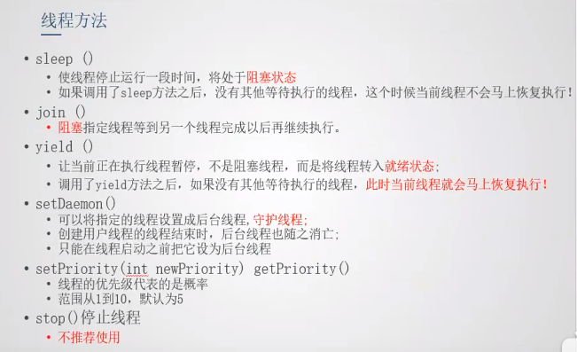

## sleep()

`sleep()` 方法需要指定等待的时间，它可以让当前正在执行的线程在指定的时间内暂停执行，进入阻塞状态，该方法既可以让其他同优先级或者高优先级的线程得到执行的机会，也可以让低优先级的线程得到执行机会。但是 `sleep()` 方法不会释放“锁标志”，也就是说如果有 `synchronized` 同步块，其他线程仍然不能访问共享数据。

## wait()

`wait()` 方法需要和 `notify()` 及 `notifyAll()` 两个方法一起介绍，这三个方法用于协调多个线程对共享数据的存取，所以必须在 `synchronized` 语句块内使用，也就是说，调用 `wait()`，`notify()` 和 `notifyAll()` 的任务在调用这些方法前必须拥有对象的锁。注意，它们都是 `Object` 类的方法，而不是 `Thread` 类的方法。

`wait()` 方法与 `sleep()` 方法的不同之处在于，`wait()` 方法会释放对象的“锁标志”。当调用某一对象的 `wait()` 方法后，会使当前线程暂停执行，并将当前线程放入对象等待池中，直到调用了 `notify()`方法后，将从对象等待池中移出任意一个线程并放入锁标志等待池中，只有锁标志等待池中的线程可以获取锁标志，它们随时准备争夺锁的拥有权。当调用了某个对象的 `notifyAll()` 方法，会将对象等待池中的所有线程都移动到该对象的锁标志等待池。

除了使用 `notify()` 和 `notifyAll()` 方法，还可以使用带毫秒参数的 `wait(long timeout)` 方法，效果是在延迟 timeout 毫秒后，被暂停的线程将被恢复到锁标志等待池。

此外，`wait()`，`notify()` 及 `notifyAll()` 只能在 `synchronized` 语句中使用，但是如果使用的是 `ReenTrantLock` 实现同步，该如何达到这三个方法的效果呢？解决方法是使用 `ReenTrantLock.newCondition()` 获取一个 `Condition` 类对象，然后 `Condition` 的 `await()`，`signal()` 以及 `signalAll()` 分别对应上面的三个方法。

## yield()

`yield()` 方法和 `sleep()` 方法类似，也不会释放“锁标志”，区别在于，它没有参数，即 `yield()` 方法只是使当前线程重新回到可执行状态，所以执行 `yield()` 的线程有可能在进入到可执行状态后马上又被执行，另外 `yield()` 方法只能使同优先级或者高优先级的线程得到执行机会，这也和 `sleep()` 方法不同。

## join()

`join()` 方法会使当前线程等待调用 `join()` 方法的线程结束后才能继续执行

## setDaemon()

JVM 不用等待守护进程执行完毕，也会停止运行。

person：用户线程

god：守护线程

```java
class God implements Runnable{
    @Override
    public void run() {
        ...死循环
    }
}

God god = new God();
Person person = new Person();
Thread t = new Thread(god);
t.setDaemon(true);
t.start;
new Thread(person).start;
```

## 其他常用方法

- isAlive()
  - 判断线程是否还活着，即线程是否还未终止
- setName()
  - 给线程起一个名字
- getName()
  - 获取线程的名字
- currentThread()
  - 取得当前正在运行的线程对象，也就是获取自己本身