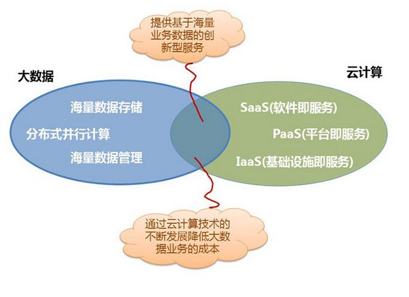

# Iaas、Paas、Saas 是云计算的三种服务模式

## Saas

Software-as-a-Service（软件即服务）提供给客户的服务是运营商运行在云计算基础设施上的应用程序，用户可以在各种设备上通过客户端界面访问，如浏览器。消费者不需要管理或控制任何云计算基础设施，包括网络、服务器、操作系统、存储等等；

## Paas

Platform-as-a-Service（平台即服务）提供给消费者的服务是把客户采用提供的开发语言和工具（例如Java，python, .Net等）开发的或收购的应用程序部署到供应商的云计算基础设施上去。

客户不需要管理或控制底层的云基础设施，包括网络、服务器、操作系统、存储等，但客户能控制部署的应用程序，也可能控制运行应用程序的托管环境配置；

## Iaas

Infrastructure-as-a-Service（基础设施即服务）提供给消费者的服务是对所有计算基础设施的利用，包括处理CPU、内存、存储、网络和其它基本的计算资源，用户能够部署和运行任意软件，包括操作系统和应用程序。

消费者不管理或控制任何云计算基础设施，但能控制操作系统的选择、存储空间、部署的应用，也有可能获得有限制的网络组件（例如路由器、，防火墙，、负载均衡器等）的控制。

## 区别：

SaaS 是软件的开发、管理、部署都交给第三方，不需要关心技术问题，可以拿来即用。普通用户接触到的互联网服务，几乎都是 SaaS，下面是一些例子。

* 客户管理服务 Salesforce
* 团队协同服务 Google Apps
* 储存服务 Box
* 储存服务 Dropbox
* 社交服务 Facebook / Twitter / Instagram

PaaS 提供软件部署平台（runtime），抽象掉了硬件和操作系统细节，可以无缝地扩展（scaling）。开发者只需要关注自己的业务逻辑，不需要关注底层。下面这些都属于 PaaS。

* Heroku
* Google App Engine
* OpenShift

IaaS 是云服务的最底层，主要提供一些基础资源。它与 PaaS 的区别是，用户需要自己控制底层，实现基础设施的使用逻辑。下面这些都属于 IaaS。

* Amazon EC2
* Digital Ocean
* RackSpace Cloud

