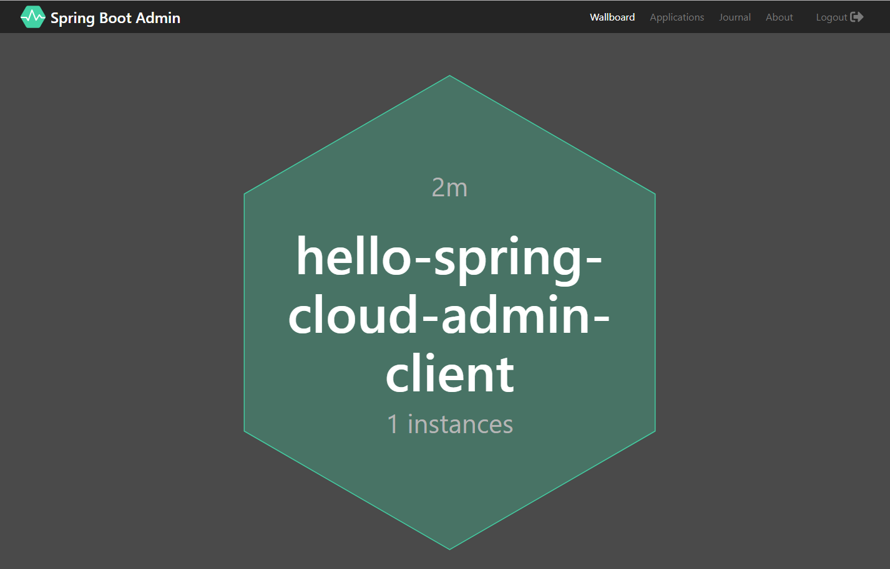

## 创建 Spring Boot Admin Client

创建一个工程名为 `hello-spring-cloud-admin-client` 的项目，`pom.xml` 文件如下：

```xml
<?xml version="1.0" encoding="UTF-8"?>
<project xmlns="http://maven.apache.org/POM/4.0.0" xmlns:xsi="http://www.w3.org/2001/XMLSchema-instance"
         xsi:schemaLocation="http://maven.apache.org/POM/4.0.0 http://maven.apache.org/xsd/maven-4.0.0.xsd">
    <modelVersion>4.0.0</modelVersion>

    <parent>
        <groupId>com.seven</groupId>
        <artifactId>hello-spring-cloud-dependencies</artifactId>
        <version>1.0.0-SNAPSHOT</version>
        <relativePath>../hello-spring-cloud-dependencies/pom.xml</relativePath>
    </parent>

    <artifactId>hello-spring-cloud-admin-client</artifactId>
    <packaging>jar</packaging>

    <name>hello-spring-cloud-admin-client</name>
    <url>http://www.funtl.com</url>
    <inceptionYear>2018-Now</inceptionYear>

    <dependencies>
        <!-- Spring Boot Begin -->
        <dependency>
            <groupId>org.springframework.boot</groupId>
            <artifactId>spring-boot-starter-web</artifactId>
        </dependency>
        <dependency>
            <groupId>org.springframework.boot</groupId>
            <artifactId>spring-boot-starter-tomcat</artifactId>
        </dependency>
        <dependency>
            <groupId>org.springframework.boot</groupId>
            <artifactId>spring-boot-starter-actuator</artifactId>
        </dependency>
        <dependency>
            <groupId>org.springframework.boot</groupId>
            <artifactId>spring-boot-starter-test</artifactId>
            <scope>test</scope>
        </dependency>

        <dependency>
            <groupId>org.jolokia</groupId>
            <artifactId>jolokia-core</artifactId>
        </dependency>
        <dependency>
            <groupId>de.codecentric</groupId>
            <artifactId>spring-boot-admin-starter-client</artifactId>
        </dependency>
        <!-- Spring Boot End -->

        <!-- Spring Cloud Begin -->
        <dependency>
            <groupId>org.springframework.cloud</groupId>
            <artifactId>spring-cloud-starter-zipkin</artifactId>
        </dependency>
        <dependency>
            <groupId>org.springframework.cloud</groupId>
            <artifactId>spring-cloud-starter-netflix-eureka-server</artifactId>
        </dependency>
        <!-- Spring Cloud End -->
    </dependencies>

    <build>
        <plugins>
            <plugin>
                <groupId>org.springframework.boot</groupId>
                <artifactId>spring-boot-maven-plugin</artifactId>
                <configuration>
                    <mainClass>com.seven.hello.spring.cloud.admin.client.AdminClientApplication</mainClass>
                </configuration>
            </plugin>
        </plugins>
    </build>
</project>
```

主要增加了 2 个依赖，`org.jolokia:jolokia-core`、`de.codecentric:spring-boot-admin-starter-client`

```xml
<dependency>
    <groupId>org.jolokia</groupId>
    <artifactId>jolokia-core</artifactId>
</dependency>
<dependency>
    <groupId>de.codecentric</groupId>
    <artifactId>spring-boot-admin-starter-client</artifactId>
</dependency>
```

其中 `spring-boot-admin-starter-client` 的版本号为：`2.0.0`，这里没写版本号是因为我已将版本号托管到 `dependencies` 项目中

## Application

程序入口类没有特别需要修改的地方

```java
package com.seven.hello.spring.cloud.admin.client;

import org.springframework.boot.SpringApplication;
import org.springframework.boot.autoconfigure.SpringBootApplication;
import org.springframework.cloud.client.discovery.EnableDiscoveryClient;

@SpringBootApplication
@EnableDiscoveryClient
public class AdminClientApplication {
    public static void main(String[] args) {
        SpringApplication.run(AdminClientApplication.class, args);
    }
}
```

## application.yml

设置端口号为：`8085`，并设置 Spring Boot Admin 的服务端地址

```yaml
spring:
  application:
    name: hello-spring-cloud-admin-client
  boot:
    admin:
      client:
        url: http://localhost:8084
  zipkin:
    base-url: http://localhost:9411

server:
  port: 8085

eureka:
  client:
    serviceUrl:
      defaultZone: http://localhost:8761/eureka/
```

主要增加了 Spring Boot Admin Client 相关配置

```yaml
spring:
  boot:
    admin:
      client:
        url: http://localhost:8084
```

## 测试服务监控

依次启动两个应用，打开浏览器访问：http://localhost:8084 界面显示如下


从图中可以看到，我们的 Admin Client 已经上线了，至此说明监控中心搭建成功

### WallBoard



### Journal


