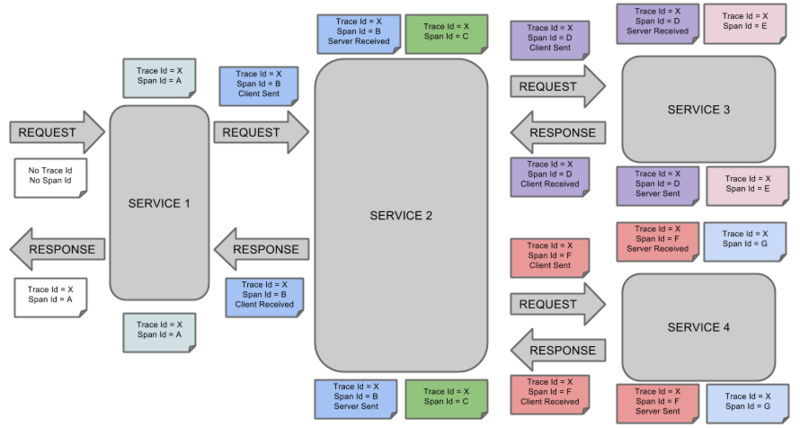
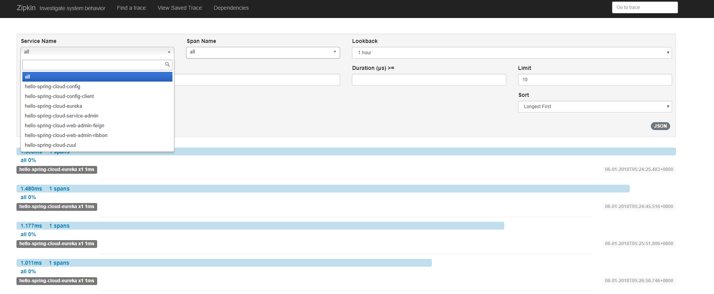
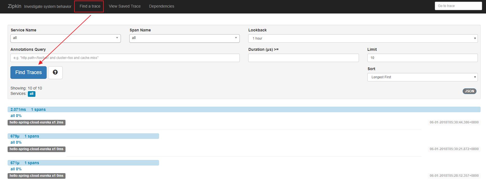

## 概述

这篇文章主要讲解服务追踪组件 ZipKin。

## ZipKin 简介

ZipKin 是一个开放源代码的分布式跟踪系统，由 Twitter 公司开源，它致力于收集服务的定时数据，以解决微服务架构中的延迟问题，包括数据的收集、存储、查找和展现。它的理论模型来自于 Google Dapper 论文。

每个服务向 ZipKin 报告计时数据，ZipKin 会根据调用关系通过 ZipKin UI 生成依赖关系图，显示了多少跟踪请求通过每个服务，该系统让开发者可通过一个 Web 前端轻松的收集和分析数据，例如用户每次请求服务的处理时间等，可方便的监测系统中存在的瓶颈。

## 服务追踪说明

微服务架构是通过业务来划分服务的，使用 REST 调用。对外暴露的一个接口，可能需要很多个服务协同才能完成这个接口功能，如果链路上任何一个服务出现问题或者网络超时，都会形成导致接口调用失败。随着业务的不断扩张，服务之间互相调用会越来越复杂。


随着服务的越来越多，对调用链的分析会越来越复杂。它们之间的调用关系也许如下：


## 术语解释

- Span：基本工作单元，例如，在一个新建的 Span 中发送一个 RPC 等同于发送一个回应请求给 RPC，Span 通过一个 64 位 ID 唯一标识，Trace 以另一个 64 位 ID 表示。
- Trace：一系列 Spans 组成的一个树状结构，例如，如果你正在运行一个分布式大数据工程，你可能需要创建一个 Trace。
- Annotation：用来即使记录一个事件的存在，一些核心 Annotations 用来定义一个请求的开始和结束
  - cs：Client Sent，客户端发起一个请求，这个 Annotation 描述了这个 Span 的开始
  - sr：Server Received，服务端获得请求并准备开始处理它，**如果将其 sr 减去 cs 时间戳便可得到网络延迟**
  - ss：Server Sent 表明请求处理的完成(当请求返回客户端)，**如果 ss 减去 sr 时间戳便可得到服务端需要的处理请求时间**
  - cr：Client Received 表明 Span 的结束，客户端成功接收到服务端的回复，**如果 cr 减去 cs 时间戳便可得到客户端从服务端获取回复的所有所需时间**

将 Span 和 Trace 在一个系统中使用 Zipkin 注解的过程图形化：



## 创建 ZipKin 服务端

创建一个工程名为 `hello-spring-cloud-zipkin` 的项目，`pom.xml` 文件如下：

```xml
<?xml version="1.0" encoding="UTF-8"?>
<project xmlns="http://maven.apache.org/POM/4.0.0" xmlns:xsi="http://www.w3.org/2001/XMLSchema-instance"
         xsi:schemaLocation="http://maven.apache.org/POM/4.0.0 http://maven.apache.org/xsd/maven-4.0.0.xsd">
    <modelVersion>4.0.0</modelVersion>

    <parent>
        <groupId>com.seven</groupId>
        <artifactId>hello-spring-cloud-dependencies</artifactId>
        <version>1.0.0-SNAPSHOT</version>
        <relativePath>../hello-spring-cloud-dependencies/pom.xml</relativePath>
    </parent>

    <artifactId>hello-spring-cloud-zipkin</artifactId>
    <packaging>jar</packaging>

    <name>hello-spring-cloud-zipkin</name>
    <url>http://www.funtl.com</url>
    <inceptionYear>2018-Now</inceptionYear>

    <dependencies>
        <!-- Spring Boot Begin -->
        <dependency>
            <groupId>org.springframework.boot</groupId>
            <artifactId>spring-boot-starter-web</artifactId>
        </dependency>
        <dependency>
            <groupId>org.springframework.boot</groupId>
            <artifactId>spring-boot-starter-tomcat</artifactId>
        </dependency>
        <dependency>
            <groupId>org.springframework.boot</groupId>
            <artifactId>spring-boot-starter-actuator</artifactId>
        </dependency>
        <dependency>
            <groupId>org.springframework.boot</groupId>
            <artifactId>spring-boot-starter-test</artifactId>
            <scope>test</scope>
        </dependency>
        <!-- Spring Boot End -->

        <!-- Spring Cloud Begin -->
        <dependency>
            <groupId>io.zipkin.java</groupId>
            <artifactId>zipkin</artifactId>
        </dependency>
        <dependency>
            <groupId>io.zipkin.java</groupId>
            <artifactId>zipkin-server</artifactId>
        </dependency>
        <dependency>
            <groupId>io.zipkin.java</groupId>
            <artifactId>zipkin-autoconfigure-ui</artifactId>
        </dependency>
        <dependency>
            <groupId>org.springframework.cloud</groupId>
            <artifactId>spring-cloud-starter-netflix-eureka-server</artifactId>
        </dependency>
        <!-- Spring Cloud End -->
    </dependencies>

    <build>
        <plugins>
            <plugin>
                <groupId>org.springframework.boot</groupId>
                <artifactId>spring-boot-maven-plugin</artifactId>
                <configuration>
                    <mainClass>com.seven.hello.spring.cloud.zipkin.ZipKinApplication</mainClass>
                </configuration>
            </plugin>
        </plugins>
    </build>
</project>
```

主要增加了 3 个依赖，`io.zipkin.java:zipkin`、`io.zipkin.java:zipkin-server`、`io.zipkin.java:zipkin-autoconfigure-ui`

```xml
<dependency>
    <groupId>io.zipkin.java</groupId>
    <artifactId>zipkin</artifactId>
</dependency>
<dependency>
    <groupId>io.zipkin.java</groupId>
    <artifactId>zipkin-server</artifactId>
</dependency>
<dependency>
    <groupId>io.zipkin.java</groupId>
    <artifactId>zipkin-autoconfigure-ui</artifactId>
</dependency>
```

注意版本号为：`2.10.1`，这里没写版本号是因为我已将版本号托管到 `dependencies` 项目中

## Application

通过 `@EnableZipkinServer` 注解开启 Zipkin Server 功能

```java
package com.seven.hello.spring.cloud.zipkin;

import org.springframework.boot.SpringApplication;
import org.springframework.boot.autoconfigure.SpringBootApplication;
import org.springframework.cloud.netflix.eureka.EnableEurekaClient;
import zipkin.server.internal.EnableZipkinServer;

@SpringBootApplication
@EnableEurekaClient
@EnableZipkinServer
public class ZipKinApplication {
    public static void main(String[] args) {
        SpringApplication.run(ZipKinApplication.class, args);
    }
}
```

## application.yml

设置端口号为：`9411`，该端口号为 Zipkin Server 的默认端口号

```yaml
spring:
  application:
    name: hello-spring-cloud-zipkin

server:
  port: 9411

eureka:
  client:
    serviceUrl:
      defaultZone: http://localhost:8761/eureka/
      
management:
  metrics:
    web:
      server:
        auto-time-requests: false
```

## 追踪服务

在 **所有需要被追踪的项目（就当前教程而言，除了 dependencies 项目外都需要被追踪，包括 Eureka Server）** 中增加 `spring-cloud-starter-zipkin` 依赖

```xml
<dependency>
    <groupId>org.springframework.cloud</groupId>
    <artifactId>spring-cloud-starter-zipkin</artifactId>
</dependency>
```

在这些项目的 `application.yml` 配置文件中增加 Zipkin Server 的地址即可

```yaml
spring:
  zipkin:
    base-url: http://localhost:9411
```

## 测试追踪

启动全部项目，打开浏览器访问：http://localhost:9411/ 会出现以下界面：



**刷新之前项目中的全部测试接口（刷多几次）**

点击 `Find a trace`，可以看到具体服务相互调用的数据



点击 `Dependencies`，可以发现服务的依赖关系


至此就代表 ZipKin 配置成功